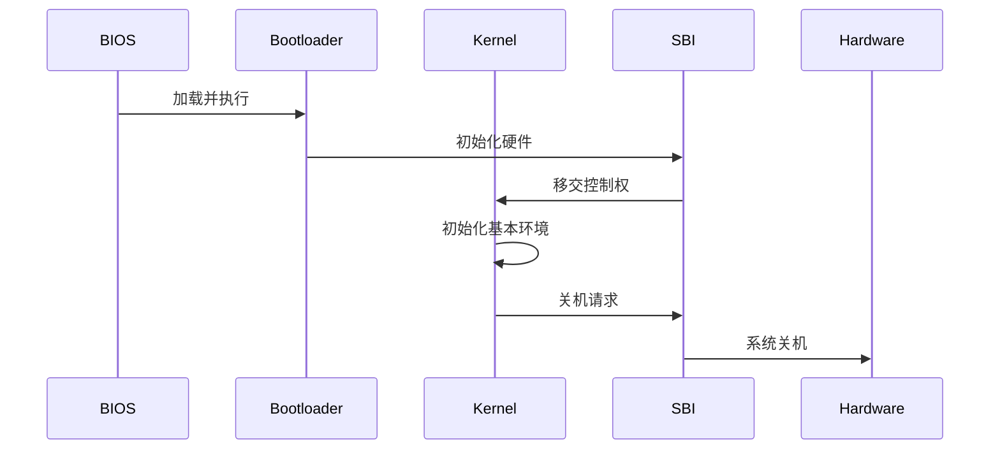

# 第一章：启动流程与裸机环境构建

> **实验日期**: {{date}}  
> **代码版本**: rCore-Tutorial v3 [d7f2a1b](https://github.com/rcore-os/rCore-Tutorial-v3/commit/d7f2a1b)  
> **QEMU版本**: 10.0.0 
> **实验环境**: Arch Linux, Rust nightly-2024-03-05

## 目录
- [1.1 核心目标](#11-核心目标)
- [1.2 关键步骤](#12-关键步骤)
- [1.3 代码实现](#13-代码实现)
- [1.4 实验验证](#14-实验验证)
- [1.5 问题排查](#15-问题排查)
- [1.6 知识拓展](#16-知识拓展)

---

## 1.1 核心目标
1. 建立裸机运行环境
2. 移除标准库依赖
3. 实现基本输出功能
4. 构建最小化内核入口
5. 实现系统关机功能

---

## 1.2 关键步骤

### 启动流程概览

#### 开发步骤

1. 创建裸机项目结构
2. 配置no_std环境
3. 实现panic处理程序
4. 构建内核入口点
5. 实现SBI封装调用
6. 添加基本输出功能

## 1.3 代码实现